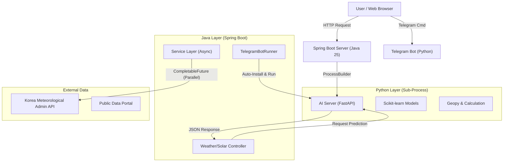

# ☀️ Solar & Smart Weather Assistant

> **Java Spring Boot x Python AI Hybrid Project**
>
> *단순 예보를 넘어, 태양광 발전 효율 예측과 라이프스타일 큐레이션을 제공하는 지능형 웹 플랫폼*


## 📖 프로젝트 소개 (Overview)
이 프로젝트는 **최신 Spring Boot 4.0**을 기반으로 **Python AI 서버** 와 유기적으로 연동되는 하이브리드 웹 애플리케이션입니다.

기상청의 방대한 공공데이터를 병렬 처리하여 실시간으로 분석하고, 자체 구축한 **머신러닝 모델(Scikit-learn)** 을 통해 **'체감온도', '옷차림 추천', '태양광 발전량 예측'** 등 사용자에게 실질적인 가치를 주는 정보를 제공합니다. 특히 **Java가 Python 프로세스의 생명주기를 직접 관리**하는 독창적인 아키텍처를 채택하여 배포 및 운영의 편의성을 극대화했습니다.

---

## 🚀 핵심 기능 (Key Features)

### 1. ⚡ AI 태양광 발전 예측 (Solar Energy Prediction)
사용자가 지역과 설비 용량(kW)을 입력하면, 천문학적 수식과 AI가 결합된 알고리즘이 내일의 발전량을 예측합니다.
* **Scientific Logic**: 태양의 적위, 고도각, 시간각을 정밀 계산하여 이론적 일사량을 산출합니다.
* **Business Insight**: 예상 발전량(kWh)뿐만 아니라 **예상 수익(원)** 과 **탄소 저감량(CO2)** 을 계산하여 경제적 가치를 시각화합니다.
* **Dual Access**: 웹 대시보드뿐만 아니라 **텔레그램 봇**을 통해서도 명령어(`/how [지역] [용량]`)로 간편하게 조회 가능합니다.

### 2. 👗 AI 라이프스타일 매니저 (Lifestyle Curation)
* **Smart Clothing (Decision Tree)**: 기온과 강수 여부를 학습한 의사결정나무 모델이 "오늘 린넨 셔츠가 좋을지, 롱패딩이 필요할지" 구체적으로 제안합니다.
* **Sensible Temperature (Linear Regression)**: 단순 기온이 아닌 습도, 풍속을 반영한 선형 회귀 모델로 정확한 체감 온도를 예측합니다.
* **AI DJ & Caster**: 날씨 분위기(비, 맑음, 밤/낮)와 시간대에 맞춰 AI가 선곡한 유튜브 플레이리스트를 재생하고, 상황에 맞는 브리핑 대본을 생성합니다.

### 3. 🛡️ 재난 안전 모니터링 (Disaster Safety)
* **Real-time Tracking**: 지진 및 태풍 발생 시 사용자의 위치와 진앙지 간의 거리를 위도/경도(`Haversine formula`)로 정밀 계산합니다.
* **Safety Guide**: 리히터 규모와 거리에 따라 "건물이 흔들릴 수 있음", "즉시 대피 필요" 등 단계별 행동 요령을 안내합니다.

### 4. 🎨 몰입형 UI/UX (Frontend)
* **Dynamic Visuals**: `Tailwind CSS` 기반의 다크 모드 지원 및 날씨 상태에 따라 배경화면과 아이콘이 실시간으로 변화합니다.
* **Sun/Moon Cycle**: SVG 애니메이션을 활용하여 현재 시간대에 따른 태양과 달의 위치를 직관적으로 시각화했습니다.
* **Interactive Charts**: `Chart.js`를 사용하여 향후 6시간의 기온 및 습도 변화 추이를 그래프로 제공합니다.

---

## 🏛️ 시스템 아키텍처 (System Architecture)

이 프로젝트는 **Java(Main Server)** 가 **Python(AI Engine)** 을 서브 프로세스로 거느리는 구조입니다.



### 🛠️ 기술적 차별점 (Technical Highlights)
1.  **Process Orchestration (`TelegramBotRunner.java`)**:
    * Spring Boot 서버 구동 시 Python 가상환경을 감지하고, 필요한 라이브러리(`pandas`, `scikit-learn` 등)가 없으면 **자동으로 설치(`pip install`)** 후 서버를 실행합니다.
    * 서버 종료 시 좀비 프로세스가 남지 않도록 Python 프로세스를 깔끔하게 정리(`taskkill`)합니다.

2.  **Concurrency & Performance**:
    * `CompletableFuture`와 `ExecutorService`를 활용해 **9개 이상의 외부 API(단기예보, 초단기예보, 미세먼지, 지진 등)를 병렬로 호출**하여 응답 속도를 획기적으로 단축했습니다.

3.  **Robust Fallback System**:
    * Python 서버나 외부 API 장애 발생 시, Java 내부에 구현된 수학적 공식(윈드칠, WBGT 등)과 하드코딩된 로직으로 자동 전환되어 **중단 없는 서비스**를 보장합니다.

---

## 💻 실행 화면 (Screenshots)

| 메인 대시보드 (Day/Night) | 태양광 발전 예측 결과 |
| :---: | :---: |
|  <br> *실시간 날씨, AI DJ, 태양 이동 경로* |   <br> *좌: 태양광 발전 정보(지역, 용량) 입력 / 우: 발전량 및 수익 예측 결과* |

| 옷차림 & AI 브리핑 | 재난 안전 상황실 |
| :---: | :---: |
|  <br> *Decision Tree 기반 옷차림 추천* |   <br> *좌: 지진 대피 경로 / 우: 태풍 영향권 분석* |

---

## 🛠️ 기술 스택 (Tech Stack)

### Backend (Java)
| Category | Technology | Description |
| --- | --- | --- |
| **Language** | Java 25 | 최신 Java 기능 활용 |
| **Framework** | Spring Boot 4.0.0 | 차세대 스프링 프레임워크 적용 |
| **Database** | Oracle, H2 | 메인 DB 및 테스트용 In-memory DB |
| **Persistence** | JPA, QueryDSL, MyBatis | 복잡한 쿼리와 생산성을 고려한 하이브리드 ORM 전략 |
| **Async & Web** | Spring WebFlux, CompletableFuture | Non-blocking API 호출 및 병렬 처리 |

### AI & Data Science (Python)
| Category | Technology | Description |
| --- | --- | --- |
| **Server** | FastAPI | 경량화된 고성능 AI 모델 서빙 (`ai_server.py`) |
| **Machine Learning** | Scikit-learn | Decision Tree (옷차림), Linear Regression (체감온도) |
| **Data Processing** | Pandas, NumPy | 데이터 전처리 및 분석 |
| **Bot** | Python-Telegram-Bot | 실시간 알림 서비스 (`predict.py`) |

### Frontend
* **Thymeleaf**: Server-side Rendering
* **Tailwind CSS**: Utility-first styling (Dark mode support)
* **Chart.js**: 기온/습도 데이터 시각화
* **SweetAlert2**: 모던한 알림 팝업

### Data Source
* **기상청 공공데이터포털**: 단기/초단기 예보, 생활기상지수, 지진/태풍 정보, 미세먼지 등
* **Sunrise-Sunset API**: 일출/일몰 시간 정밀 계산
* **YouTube**: 날씨별 음악 추천 연동

---

## 🔧 설치 및 실행 방법 (Installation)

1.  **프로젝트 클론**
    ```bash
    git clone https://github.com/csh6170/KH3_Solar.git
    cd KH3_Solar
    ```

2.  **환경 설정**
    * `src/main/resources/application.properties` 파일에서 DB 설정을 확인합니다.
    * `WeatherService.java`, `TomorrowWeatherService.java` 등의 파일 내 API Key를 본인의 공공데이터포털 키로 교체합니다.

3.  **애플리케이션 실행**
    * Java JDK 25가 설치되어 있어야 합니다.
    * 별도의 Python 실행이 필요 없습니다. Spring Boot가 자동으로 Python 환경을 구성하고 실행합니다.
    ```bash
    ./gradlew bootRun
    ```

4.  **접속**
    * 웹 대시보드: `http://localhost:8080`
    * AI 서버(자동실행): `http://localhost:5000`

---

## 👨‍💻 개발 팀 (Team)

| 팀   원 | 담당 역할 및 기여 (Role & Contribution) |
| :-----: | :----- |
| **최성호** | **☀️ Solar AI Engine & Bot Developer**<br>• **Solar Logic:** 태양의 위치(고도각/시간각) 기반 이론적 일사량 산출 알고리즘 및 경제성 분석 구현<br>• **Process Orchestration:** Spring Boot 내 Python 프로세스 생명주기 관리 및 자동 실행 구현(`TelegramBotRunner`) <br>• **Telegram Bot:** Python 봇(`predict.py`) 개발 및 실시간 발전량 알림 서비스 구현<br>• **View Integration:** 태양광 발전 예측 결과 화면(`result.html`) 및 봇 연동 UI 개발 |
| **조보근** | **🏗️ Core Backend & Lifestyle Service**<br>• **Architecture:** Spring Boot 메인 구조 설계 및 비동기 API 병렬 처리(`CompletableFuture`) 구현<br>• **Weather & Disaster:** 기상청 API 연동, 지진/태풍 거리 계산 로직 및 옷차림/DJ/체감온도 서비스 개발<br>• **Frontend:** 메인 대시보드(`weather.html`), 재난 상황판(`earthquake.html`) 등 주요 웹 뷰 구현 |

---

## 📝 License

This project is licensed under the MIT License.
